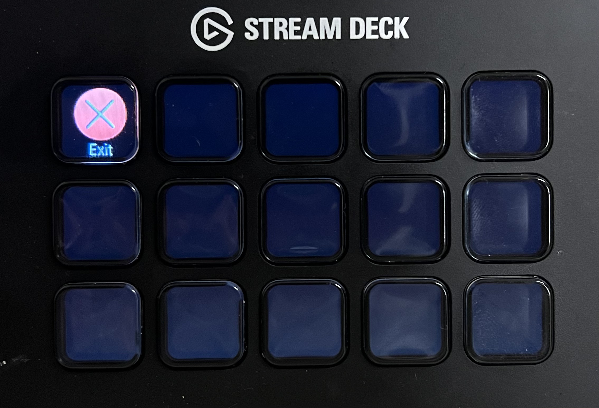

## Streamy Deck

Build apps easily on the Stream Deck.

*Available on PyPI*

```
pip install streamydeck
```

### Get Started

Let's build a simple app to display an exit button. If we click on it, the program will close.

```python
from streamydeck import init_stream_deck, Element, View, start, terminate

deck = init_stream_deck()
my_view = View('main', deck)
my_view[0, 0] = Element('exit', label='Exit').on_action(terminate, deck)
my_view.render()
start(deck)
```

You will see this on your Stream Deck:

</img>

### Other examples

It's easy to build more complicated apps like a calculator: [assets/calc.mp4](assets/calc.mp4).
